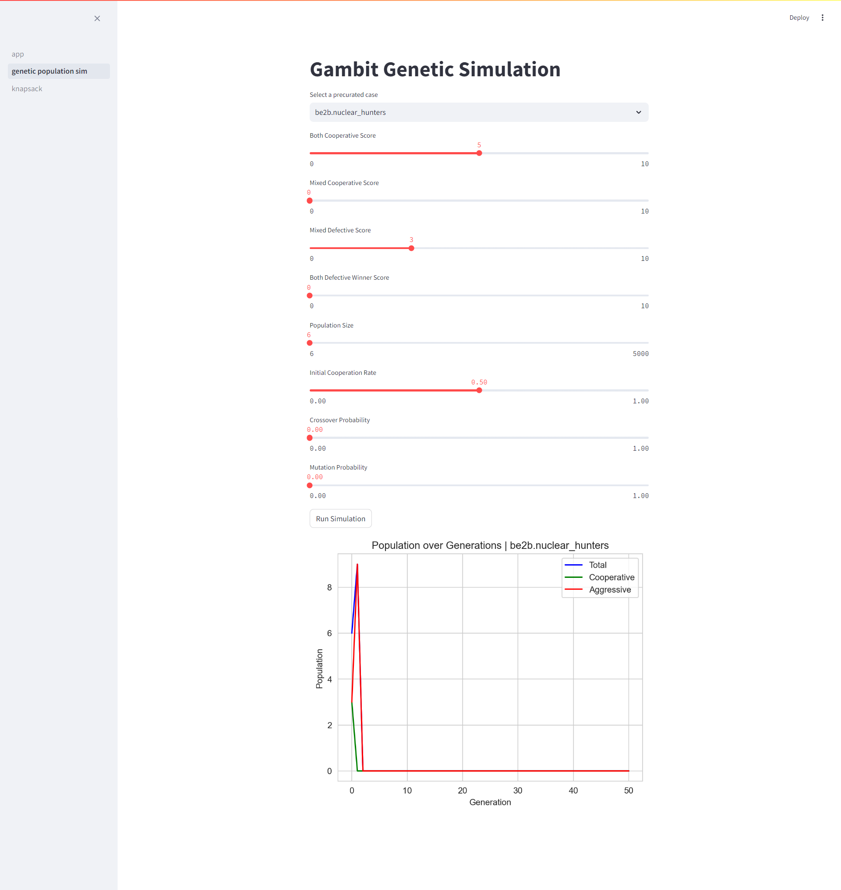
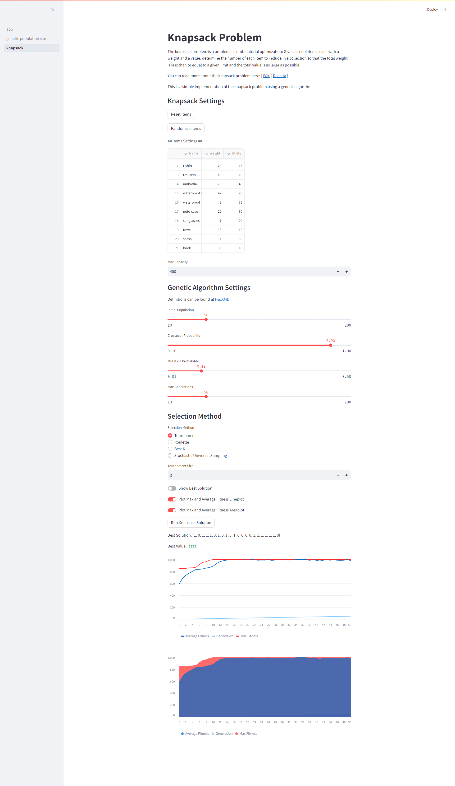

# Introduction

## A statement of intent 

The purpose of this simulation is to explore the applications of genetic algorithms in the context of biological anthropology. Specifically, we aim to identify solutions and conditions that can be used to establish relationships that provide insights into possible explanations of anthropological behaviors.

This project is intded to be used in coordination with the report at:
https://hackmd.io/@n_1IfOpxQPSjyRrn5yedJw/r1fbS-RZC

## Running Web Simulator Locally


```
cd streamlit
pip install -r requirements.txt
streamlit run app.py
```






